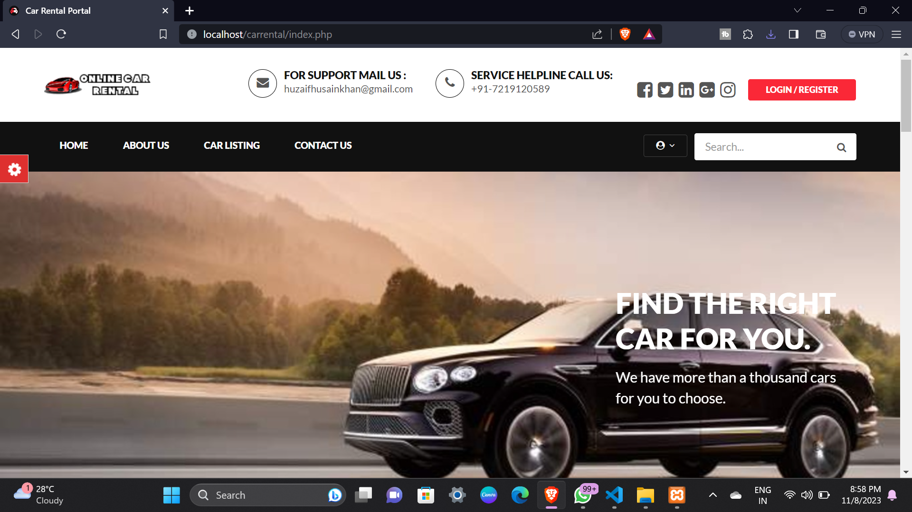
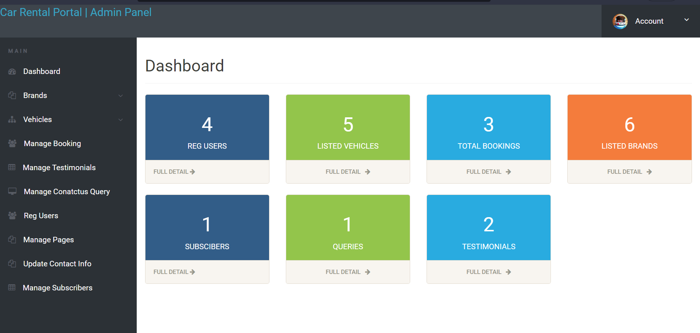
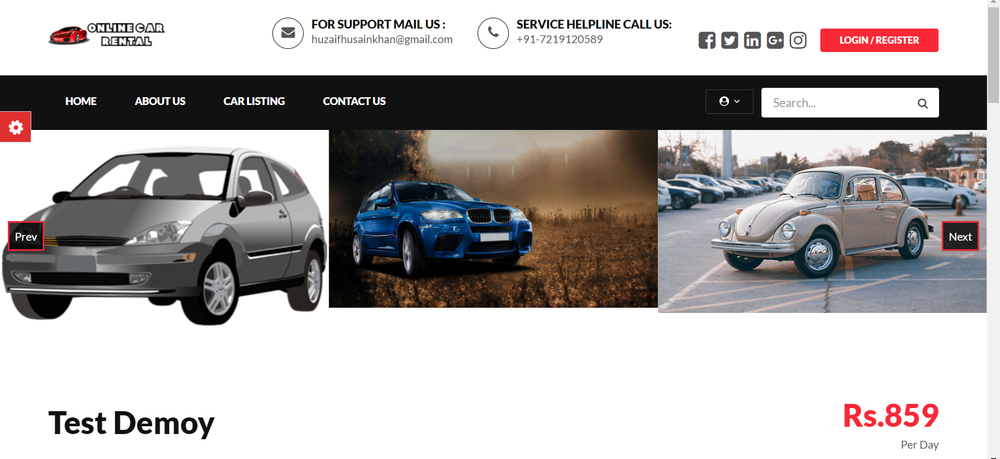
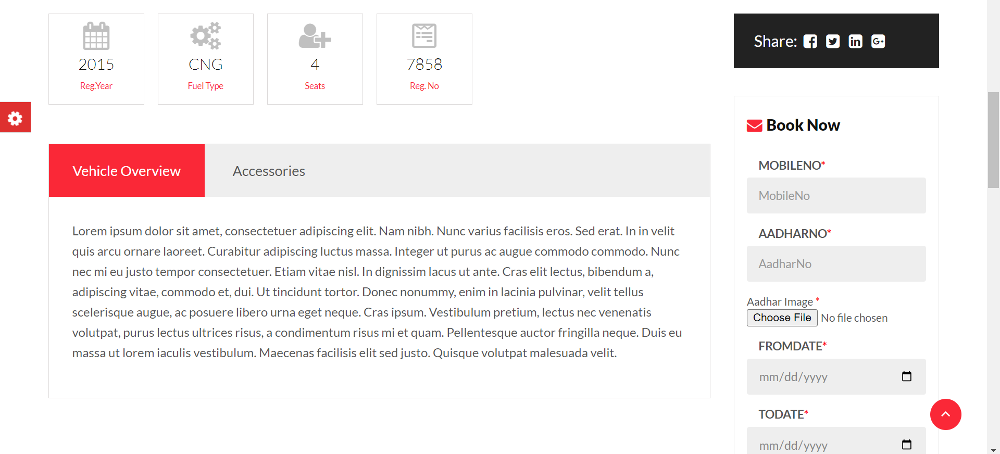
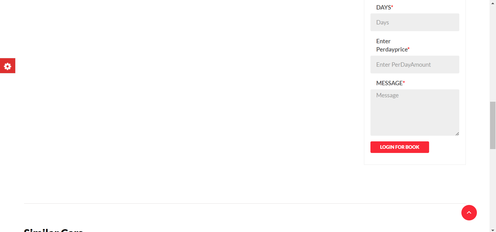

# carrental-managment-system
It is a simple Car Rental Database Management System.

> Car Rental Project in PHP

### Screenshots

### admin dashboard

### car booking

### car listing

### Description

Here, User has to Login To book a car. The user can search for cars easily and book. For bookings, the user has to provide information such as Booking Dates and Text Message. All car details are provided and it also includes Car’s feature and Overview. The user can also post their Testimonials and the user can update their Profile as well as passwords anytime they want from the site. Admin can Add/Manage car brands, manage vehicles, bookings, testimonial, pages and many more.  It’s easy to operate and understand by users. This site makes customers easy for car rental. The design is pretty simple and the user won’t find it difficult to understand, use and navigate.

### Features 

Login/Register System.
Easy Bookings.
Create/Manage Brands.
Post/Manage Vehicle.
Manage Bookings, Testimonials, Contact Queries, Pages.
Admin dashboard,etc.

### How To Run?
You’ll need XAMP Server or WAMP Server. Put the file inside “c:/wamp/www/” or “c:/xampp/htdocs/”. Go To “localhost/phpmyadmin” in any browser and create Database (name according to SQL file).In that Database, Import the SQL file and finally go to URL: “http://localhost/file_name/phpfilename”
Don’t Forget To create a database and import SQL file to run.

